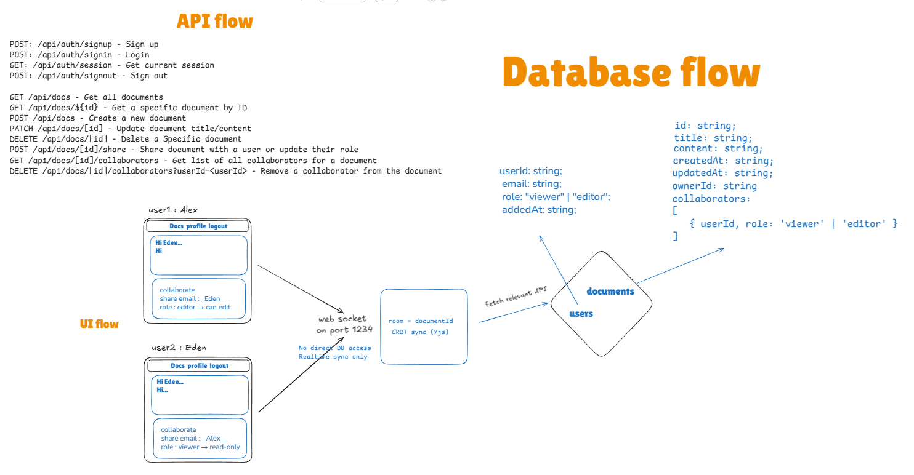
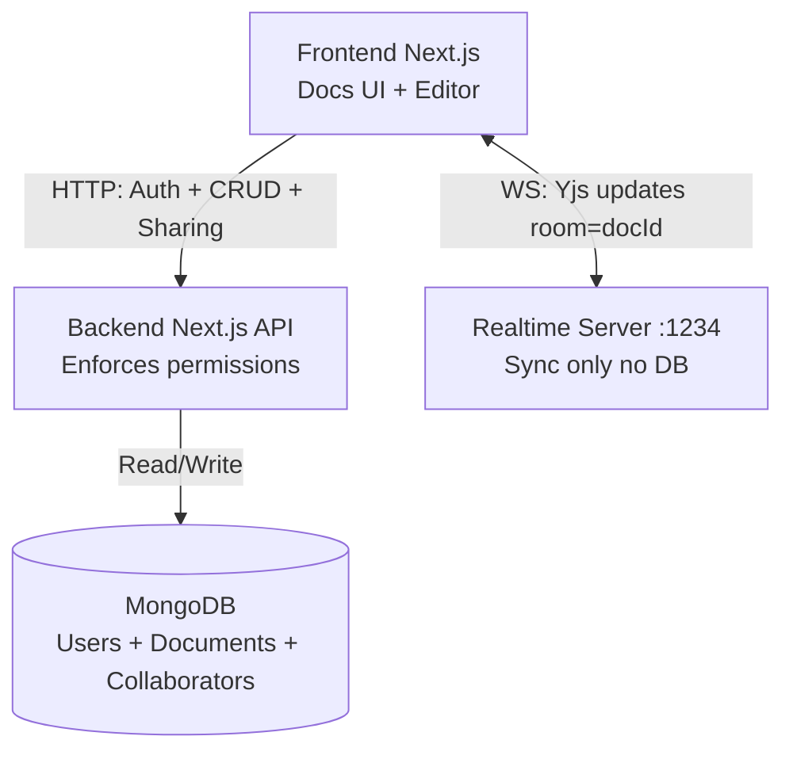
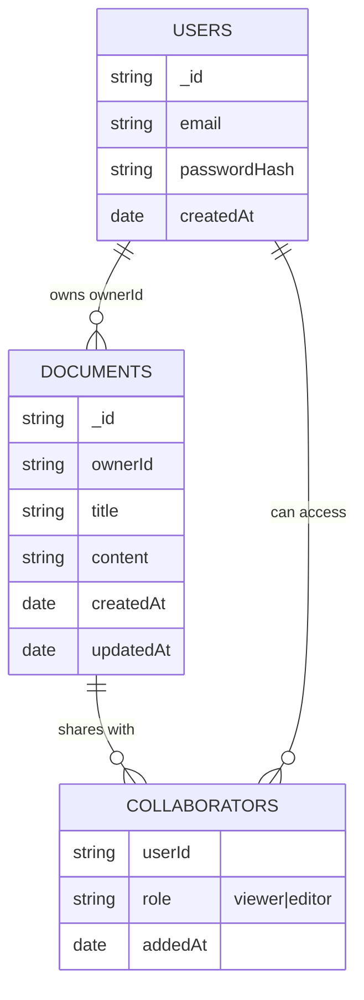
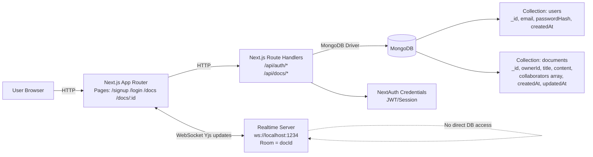

# Realtime Collaborative Documents (Notion-lite)

<table>
<tr>
<td width="50%">

A real-time collaborative document editor built with **Next.js**, **MongoDB**, and **Yjs**.  
The application allows multiple users to create, edit, and share documents with fine-grained permissions, while synchronizing changes live using **WebSockets** and **CRDTs**.

This project demonstrates real-world concepts such as authentication, authorization, real-time state synchronization, and multi-user system design.

 </td>
<td width="50%">

**📹 Watch the Demo**

<iframe width="100%" height="315" src="https://www.youtube.com/embed/AJ23o3ecFgg" frameborder="0" allow="accelerometer; autoplay; clipboard-write; encrypted-media; gyroscope; picture-in-picture" allowfullscreen></iframe>

</td>
</tr>
</table>

---

## 🏗️ System Architecture


## This diagram illustrates how HTTP APIs, WebSocket-based realtime sync, and MongoDB interact to support secure collaborative editing.

### Key idea
- HTTP API is responsible for **security & persistence** (auth, permissions, MongoDB writes).
- WebSocket server is responsible for **realtime sync only** (broadcasting Yjs CRDT updates per document room).
- Documents are **private by default** and access is granted explicitly via collaborators (viewer/editor).






---

## 🚀 Features

### 🔐 Authentication
- Signup & Login using **NextAuth (Credentials)**
- Session/JWT based authentication
- Secure password hashing with bcrypt

### 📄 Documents
- Create, read, update, delete documents (CRUD)
- Documents are **private by default**
- Each document belongs to an owner

### 🤝 Sharing & Permissions
Documents support explicit sharing with roles:
- **Owner** – full access (edit, share, delete)
- **Editor** – can edit and save content
- **Viewer** – read-only access

Permissions can be:
- Granted
- Updated (viewer ↔ editor)
- Revoked

### ⚡ Realtime Collaboration
- Live text synchronization between multiple users
- Multiple users can edit the same document simultaneously
- Changes appear instantly without conflicts
- Powered by:
  - **WebSockets**
  - **Yjs (CRDT)** for conflict-free concurrent editing

### 💾 Persistence
- All data stored in **MongoDB**
- Documents and permissions are persisted
- Content can be saved as snapshots

---

## 🧠 How It Works (High Level)

### Authentication Flow
1. User signs up (`/signup`)
2. Input validated on server (Zod)
3. Password hashed and stored in MongoDB
4. User logs in (`/login`)
5. Session/JWT created via NextAuth

### Document Access Flow
For any document request:
1. Verify authenticated session
2. Validate document ID (MongoDB ObjectId)
3. Check document existence
4. Enforce permissions (owner/editor/viewer)
5. Allow or deny access accordingly

### Realtime Collaboration Flow
- Each document is mapped to a WebSocket "room" using its document ID
- Clients connected to the same document receive live updates
- Yjs CRDT ensures:
  - No text conflicts
  - Consistent state across clients
- Authorization is enforced at the HTTP/API layer

---

## ▶️ Running the Project

### 1. Start the Realtime WebSocket Server
The realtime server runs on port **1234** and is required for live collaboration:

```bash
npm run realtime
```

### 2. Start the Next.js Development Server
In a separate terminal, start the Next.js application:

```bash
npm run dev
```

The application will be available at `http://localhost:3000`